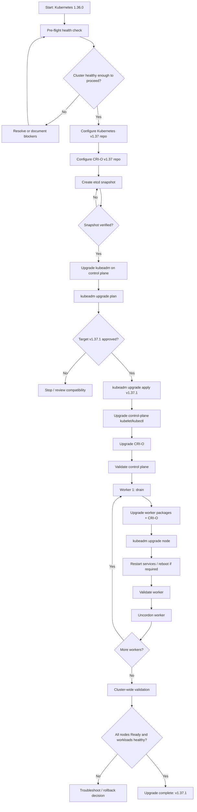
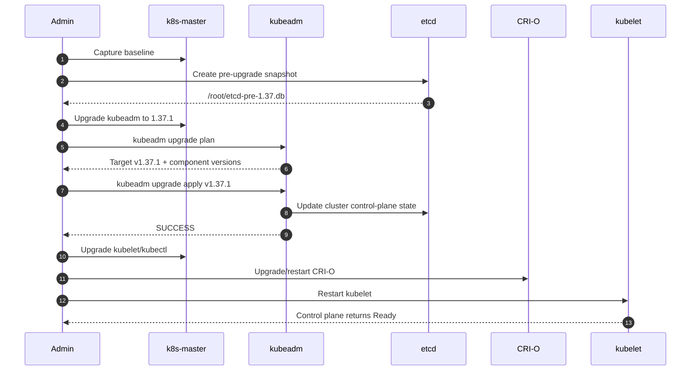
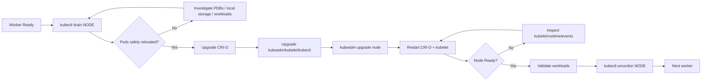
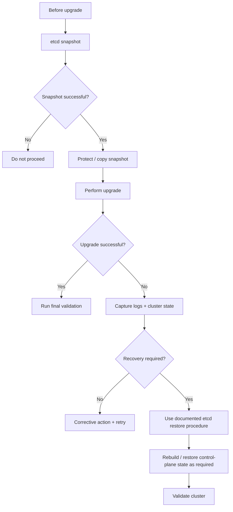
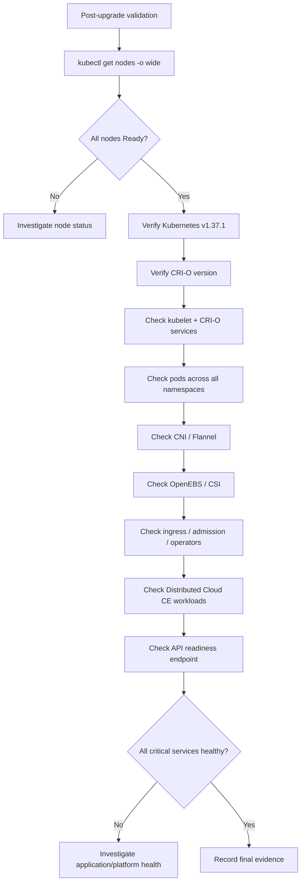

# Kubernetes 1.36 → 1.37 Upgrade Runbook

A practical, repeatable runbook based on a real `kubeadm` cluster upgrade from **Kubernetes 1.36.0 → 1.37.1** using **CRI-O**, Ubuntu 26.04 LTS, Flannel, OpenEBS, and a Volterra/F5 Distributed Cloud CE workload.


> **Scope:** This repository documents the upgrade performed in October 2026 and turns the observed commands into a reusable runbook. Commands under `scripts/` are templates; review them against your environment before execution.

## Environment captured in the upgrade

| Item | Before | Final observed state |
|---|---|---|
| Kubernetes | 1.36.0 | **1.37.1** |
| kubeadm | 1.36.0 | **1.37.1** |
| kubelet | 1.36.0 | **1.37.1** |
| kubectl | 1.36.0 | **1.37.1** |
| CRI-O | 1.36.0 | **1.37.2** |
| OS | Ubuntu 26.04 LTS | Ubuntu 26.04.1 LTS |
| Nodes | 1 control plane + 4 workers | 1 control plane + 4 workers |
| CNI | Flannel | Flannel |
| Storage | OpenEBS | OpenEBS |
| Control-plane IP | 192.168.0.86 | 192.168.0.86 |
| Workers | .87, .88, .89, .90 | same |

The final `kubectl get nodes -o wide` showed all five nodes `Ready`, Kubernetes `v1.37.1`, and CRI-O `1.37.2`.

## Official documentation

- Kubernetes: Upgrading kubeadm clusters — https://kubernetes.io/docs/tasks/administer-cluster/kubeadm/kubeadm-upgrade/
- Kubernetes: Upgrading Linux nodes — https://kubernetes.io/docs/tasks/administer-cluster/kubeadm/upgrading-linux-nodes/
- Kubernetes: Cluster upgrade overview — https://kubernetes.io/docs/tasks/administer-cluster/cluster-upgrade/
- Kubernetes: Installing kubeadm / package repositories — https://kubernetes.io/docs/setup/production-environment/tools/kubeadm/install-kubeadm/
- Kubernetes: etcd backup and restore — https://kubernetes.io/docs/tasks/administer-cluster/configure-upgrade-etcd/
- Kubernetes: Version skew policy — https://kubernetes.io/releases/version-skew-policy/
- CRI-O — https://cri-o.io/

# Upgrade Flow Diagrams

The complete upgrade flow is embedded directly in this README so the repository landing page contains the operational sequence, control-plane and worker procedures, backup/recovery path, validation, and node-by-node progression.

## 1. End-to-end upgrade flow



## 2. Control-plane sequence



## 3. Worker node sequence

Run **one worker at a time** so capacity remains available.



## 4. Backup and recovery decision flow



> The restore branch is a **decision path**, not a claim that an etcd restore was performed during the captured upgrade.

## 5. Validation flow



## 6. Node-by-node progression

```mermaid
gantt
    title Kubernetes 1.36.0 → 1.37.1 Node Upgrade Sequence
    dateFormat  X
    axisFormat %s
    section Control Plane
    Baseline + etcd backup :done, cp1, 0, 1
    kubeadm upgrade        :done, cp2, 1, 2
    kubelet/kubectl + CRI-O:done, cp3, 2, 3
    section Worker 1
    Drain                  :done, w1a, 3, 4
    Package/runtime upgrade:done, w1b, 4, 5
    Validate + uncordon    :done, w1c, 5, 6
    section Worker 2
    Drain                  :done, w2a, 6, 7
    Package/runtime upgrade:done, w2b, 7, 8
    Validate + uncordon    :done, w2c, 8, 9
    section Worker 3
    Drain                  :done, w3a, 9, 10
    Package/runtime upgrade:done, w3b, 10, 11
    Validate + uncordon    :done, w3c, 11, 12
    section Worker 4
    Drain                  :done, w4a, 12, 13
    Package/runtime upgrade:done, w4b, 13, 14
    Validate + uncordon    :done, w4c, 14, 15
    section Final
    Cluster validation     :done, final, 15, 16
```




## Important lessons from the actual run

1. **Do not skip minor versions.** The documented supported path is 1.36 → 1.37; jumping across minor versions is unsupported.
2. `kubeadm upgrade plan` identified both the latest 1.36 patch and the 1.37 target. The actual run selected `v1.37.1`.
3. The upgrade produced a **pause/sandbox image warning**: the runtime had `registry.k8s.io/pause:3.10.1`, while kubeadm recommended `3.10.2`. Treat this as a follow-up validation item rather than ignoring it.
4. Ubuntu reported a **pending kernel upgrade** several times. The final evidence shows the control plane and most workers on kernel `7.0.0-38-generic`; node1 temporarily remained on `7.0.0-31-generic` during part of the run.
5. An etcd snapshot was successfully created at `/root/etcd-pre-1.37.db` before the successful `kubeadm upgrade apply`.
6. The initial `kubeadm upgrade apply` attempts were interrupted, but the subsequent run completed successfully.
7. The cluster had an existing `ves-system/ver-0` pod in `CrashLoopBackOff` (`16/17`) before/during the upgrade. **Do not attribute that application condition to the Kubernetes upgrade without separate evidence.**
8. The final observed runtime was CRI-O `1.37.2`, after first upgrading CRI-O to `1.37.1` and later updating it.

## Quick commands

### Baseline

```bash
kubectl version
kubectl get nodes -o wide
kubectl get pods -A
kubectl get pods -A -o wide
kubectl get --raw='/readyz?verbose'
```

### Package repositories

```bash
sudo cat /etc/apt/sources.list.d/kubernetes.list
sudo cat /etc/apt/sources.list.d/cri-o.list
apt-cache madison kubelet | head
```

### etcd backup

```bash
sudo ETCDCTL_API=3 etcdctl snapshot save /root/etcd-pre-1.37.db \
  --endpoints=https://127.0.0.1:2379 \
  --cacert=/etc/kubernetes/pki/etcd/ca.crt \
  --cert=/etc/kubernetes/pki/etcd/server.crt \
  --key=/etc/kubernetes/pki/etcd/server.key
```

### Control plane

```bash
sudo apt-mark unhold kubeadm && \
  sudo apt-get update && \
  sudo apt-get install -y kubeadm='1.37.1-1.1' && \
  sudo apt-mark hold kubeadm

kubeadm version
sudo kubeadm upgrade plan
sudo kubeadm upgrade apply v1.37.1

sudo systemctl daemon-reload
sudo systemctl restart kubelet

sudo apt-mark unhold kubelet kubectl && \
  sudo apt-get update && \
  sudo apt-get install -y kubelet='1.37.1-1.1' kubectl='1.37.1-1.1' && \
  sudo apt-mark hold kubelet kubectl
```

### Worker node template

Kubernetes' documented worker procedure should be followed one node at a time. Drain from a machine with cluster-admin access, perform the host/package upgrade on the worker, run `kubeadm upgrade node`, then uncordon after validation.

```bash
# From the control plane / admin workstation:
kubectl drain <NODE> --ignore-daemonsets --delete-emptydir-data

# On <NODE>:
sudo apt-mark unhold kubeadm kubelet kubectl
sudo apt-get update
sudo apt-get install -y kubeadm='1.37.1-1.1' kubelet='1.37.1-1.1' kubectl='1.37.1-1.1'
sudo kubeadm upgrade node
sudo systemctl daemon-reload
sudo systemctl restart kubelet
sudo apt-mark hold kubeadm kubelet kubectl

# Back on the control plane:
kubectl get node <NODE> -o wide
kubectl uncordon <NODE>
```

> The exact historical worker command sequence in the source notes included `kubeadm upgrade node`; the notes do not provide a complete drain/uncordon transcript. The drain/uncordon steps above are therefore the **recommended documented workflow**, not a claim that those exact commands were captured in the session.

## Repository layout

```text
.
├── README.md
├── LICENSE
├── .gitignore
├── docs/
│   ├── upgrade-runbook.md
│   ├── mermaid-upgrade-flows.md
│   ├── preflight-checklist.md
│   ├── troubleshooting.md
│   └── official-docs.md
├── scripts/
│   ├── baseline.sh
│   ├── configure-k8s-repo.sh
│   ├── configure-crio-repo.sh
│   ├── backup-etcd.sh
│   ├── upgrade-control-plane.sh
│   ├── upgrade-worker.sh
│   └── validate.sh
└── evidence/
    └── upgrade-notes.md
```

## Safety

This is infrastructure-change documentation, not a blind automation package. Always verify:

- supported Kubernetes and CRI-O versions;
- API deprecations and release notes;
- CNI and CSI compatibility;
- admission webhooks and operators;
- PodDisruptionBudgets;
- application/database backups;
- storage behavior, especially OpenEBS local volumes;
- node capacity before draining;
- kernel reboot requirements;
- CE/Volterra compatibility if running Distributed Cloud CE in the cluster.

Never paste private keys, kubeconfig credentials, cloud tokens, or other secrets into the repository.
