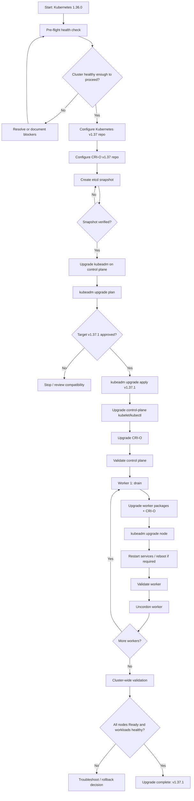
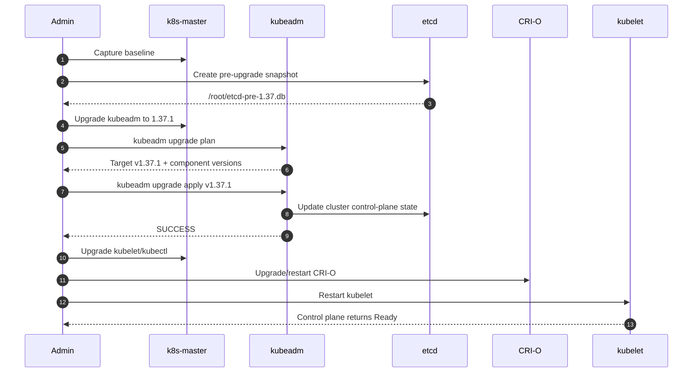
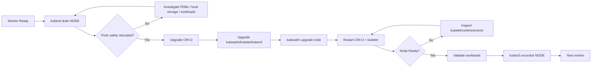
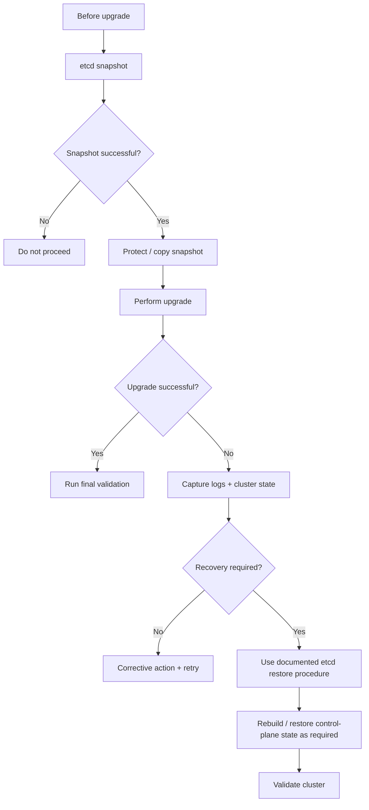
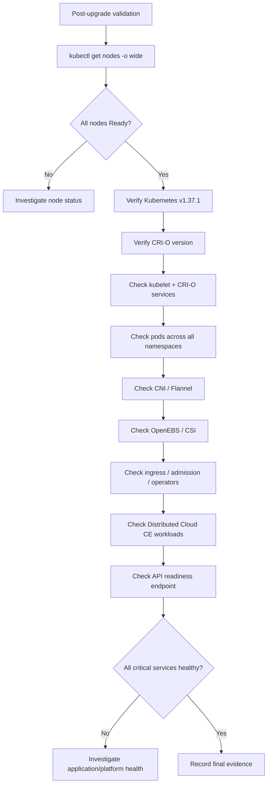

# Mermaid Upgrade Flows

These diagrams are designed to make the upgrade sequence easy to review before execution. They reflect the captured **Kubernetes 1.36.0 → 1.37.1** upgrade and distinguish observed actions from recommended operational controls such as drain/uncordon.

## 1. End-to-end upgrade flow

## 2. Control-plane sequence

## 3. Worker node sequence

Run **one worker at a time** so capacity remains available.

## 4. Backup and recovery decision flow

> The restore branch is a **decision path**, not a claim that an etcd restore was performed during the captured upgrade.

## 5. Validation flow

## 6. Node-by-node progression

```mermaid
gantt
    title Kubernetes 1.36.0 → 1.37.1 Node Upgrade Sequence
    dateFormat  X
    axisFormat %s
    section Control Plane
    Baseline + etcd backup :done, cp1, 0, 1
    kubeadm upgrade        :done, cp2, 1, 2
    kubelet/kubectl + CRI-O:done, cp3, 2, 3
    section Worker 1
    Drain                  :done, w1a, 3, 4
    Package/runtime upgrade:done, w1b, 4, 5
    Validate + uncordon    :done, w1c, 5, 6
    section Worker 2
    Drain                  :done, w2a, 6, 7
    Package/runtime upgrade:done, w2b, 7, 8
    Validate + uncordon    :done, w2c, 8, 9
    section Worker 3
    Drain                  :done, w3a, 9, 10
    Package/runtime upgrade:done, w3b, 10, 11
    Validate + uncordon    :done, w3c, 11, 12
    section Worker 4
    Drain                  :done, w4a, 12, 13
    Package/runtime upgrade:done, w4b, 13, 14
    Validate + uncordon    :done, w4c, 14, 15
    section Final
    Cluster validation     :done, final, 15, 16
```

