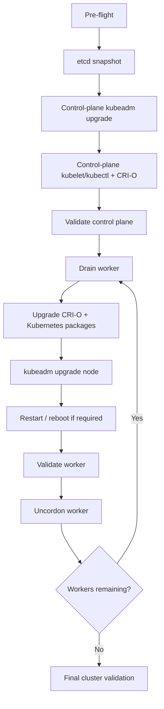

# Upgrade Runbook: Kubernetes 1.36 → 1.37

## Visual upgrade map

Use the Mermaid diagrams in [`mermaid-upgrade-flows.md`](mermaid-upgrade-flows.md) alongside this runbook. The key operational rule is **control plane first, then one worker at a time with drain → upgrade → validate → uncordon**.



## 1. Pre-flight

Run on the control plane:

```bash
kubectl version
kubectl get nodes -o wide
kubectl get pods -A
kubectl get pods -A -o wide
kubectl get --raw='/readyz?verbose'
kubeadm version
sudo kubeadm upgrade plan
```

Record:

- Kubernetes version
- kubeadm/kubelet/kubectl versions
- CRI-O version
- OS/kernel
- CNI/CSI versions
- all `NotReady`, `Pending`, `CrashLoopBackOff`, or unhealthy workloads
- PodDisruptionBudgets
- local-storage workloads

### Baseline captured in the source notes

The cluster was a single control-plane node (`k8s-master`) plus four workers (`k8s-node1` through `k8s-node4`). The control plane IP was `192.168.0.86`; workers were `.87`–`.90`. Before the upgrade all nodes were Kubernetes `v1.36.0` and CRI-O `1.36.0`.

The source also showed `ves-system/ver-0` at `16/17` with `CrashLoopBackOff` and thousands of restarts. That condition should be recorded as pre-existing health debt and investigated independently.

## 2. Package repositories

Kubernetes uses a separate package repository per minor release. For 1.37:

```bash
echo 'deb [signed-by=/etc/apt/keyrings/kubernetes-apt-keyring.gpg] https://pkgs.k8s.io/core:/stable:/v1.37/deb/ /' \
  | sudo tee /etc/apt/sources.list.d/kubernetes.list

sudo apt update
apt-cache madison kubelet | head
```

CRI-O:

```bash
export CRIO_VERSION=v1.37

curl -fsSL "https://download.opensuse.org/repositories/isv:/cri-o:/stable:/$CRIO_VERSION/deb/Release.key" \
  | gpg --dearmor | sudo tee /etc/apt/keyrings/cri-o-apt-keyring.gpg > /dev/null

echo "deb [signed-by=/etc/apt/keyrings/cri-o-apt-keyring.gpg] https://download.opensuse.org/repositories/isv:/cri-o:/stable:/$CRIO_VERSION/deb/ /" \
  | sudo tee /etc/apt/sources.list.d/cri-o.list

sudo apt update
```

## 3. Backup etcd

```bash
sudo ETCDCTL_API=3 etcdctl snapshot save /root/etcd-pre-1.37.db \
  --endpoints=https://127.0.0.1:2379 \
  --cacert=/etc/kubernetes/pki/etcd/ca.crt \
  --cert=/etc/kubernetes/pki/etcd/server.crt \
  --key=/etc/kubernetes/pki/etcd/server.key
```

Verify the file exists and protect it. Kubernetes documents etcd as the backing store for all cluster state and recommends regular backups.

## 4. Upgrade the first/control-plane node

```bash
sudo apt-mark unhold kubeadm && \
  sudo apt-get update && \
  sudo apt-get install -y kubeadm='1.37.1-1.1' && \
  sudo apt-mark hold kubeadm

kubeadm version
sudo kubeadm upgrade plan
sudo kubeadm upgrade apply v1.37.1
```

The successful run reported:

```text
[upgrade] SUCCESS! A control plane node of your cluster was upgraded to "v1.37.1".
```

Then upgrade the control-plane kubelet and kubectl:

```bash
sudo systemctl daemon-reload
sudo systemctl restart kubelet

sudo apt-mark unhold kubelet kubectl && \
  sudo apt-get update && \
  sudo apt-get install -y kubelet='1.37.1-1.1' kubectl='1.37.1-1.1' && \
  sudo apt-mark hold kubelet kubectl
```

## 5. Upgrade CRI-O

The captured run upgraded CRI-O to 1.37.1 and later observed 1.37.2.

```bash
sudo apt install -y 'cri-o=1.37.1*'
sudo systemctl daemon-reload
sudo systemctl restart crio
crio --version
```

For the final state, verify the installed version available from the configured 1.37 repository rather than assuming `1.37.2` will always be present.

## 6. Upgrade workers one at a time

### A. Drain

```bash
kubectl drain k8s-node1 --ignore-daemonsets --delete-emptydir-data
```

Check workload relocation before proceeding.

### B. Upgrade worker packages

```bash
sudo apt-mark unhold kubeadm kubelet kubectl
sudo apt-get update
sudo apt-get install -y kubeadm='1.37.1-1.1' kubelet='1.37.1-1.1' kubectl='1.37.1-1.1'
```

Upgrade the CRI-O runtime as appropriate, then:

```bash
sudo kubeadm upgrade node
sudo systemctl daemon-reload
sudo systemctl restart kubelet
sudo apt-mark hold kubeadm kubelet kubectl
```

### C. Validate and uncordon

```bash
kubectl get node k8s-node1 -o wide
kubectl get pods -A -o wide
kubectl uncordon k8s-node1
```

Repeat for node2, node3, and node4.

## 7. Reboot / kernel handling

The source notes repeatedly showed a pending kernel upgrade. A reboot was required to activate the newer kernel. Schedule this as part of node maintenance, not as an implicit side effect of the Kubernetes package upgrade.

After reboot:

```bash
uname -r
systemctl is-active kubelet
systemctl is-active crio
kubectl get node <NODE> -o wide
```

## 8. Final validation

```bash
kubectl get nodes -o wide
kubectl get pods -A
kubectl get pods -A -o wide
kubectl get --raw='/readyz?verbose'
```

Expected final version alignment from the captured run:

```text
k8s-master  Ready  control-plane  v1.37.1  cri-o://1.37.2
k8s-node1   Ready  <none>         v1.37.1  cri-o://1.37.2
k8s-node2   Ready  <none>         v1.37.1  cri-o://1.37.2
k8s-node3   Ready  <none>         v1.37.1  cri-o://1.37.2
k8s-node4   Ready  <none>         v1.37.1  cri-o://1.37.2
```

Also check that the CNI, OpenEBS components, ingress controller, and Distributed Cloud CE workloads are healthy.
